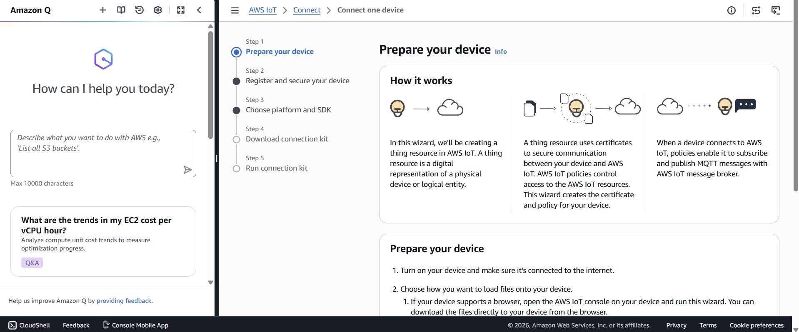
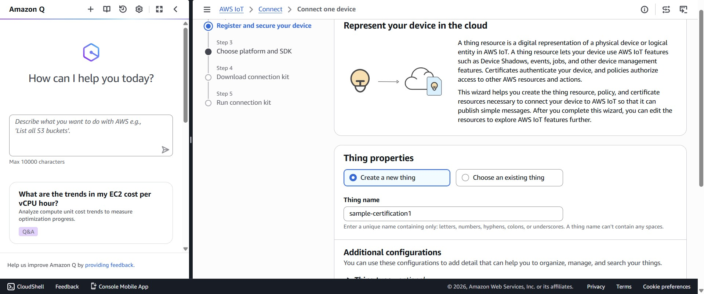
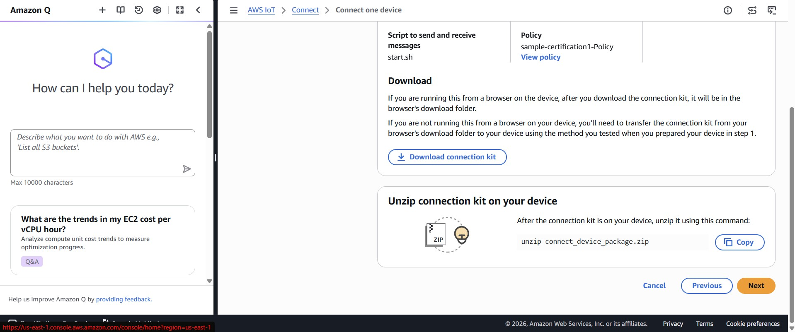

Connecting the nRF9160 to AWS IoT Core

To get started, create an AWS account if you do not already have one. Connecting the nRF9160 to AWS IoT Core requires TLS certificates for secure authentication between the device and AWS.

1. Log in to the AWS Management Console.
2. Search for "IoT Core" in the AWS search bar and open the AWS IoT Core service.
3. In the left-hand menu, under "Connect" click "Connect one device".
  
4. Scroll down and click "Next"
5. Click "Create Thing"
6. Enter a "Thing name" and click Next.
   
8. Since the nRF board is being connected, keep the deafult selections on the web page for the SDK. 
9. Download the connection kit and inside you will find the AWS certificates.
    
11. Extract the certificates ending with ".cert.pem" and ".private.key"
12. Next get the Amazon Root CA 1 certificate by using this link: https://www.amazontrust.com/repository/AmazonRootCA1.pem
13. Before proceeding further, ensure that the nRF board is equipped with a sim card and an antenna (as illustrated below):
    
